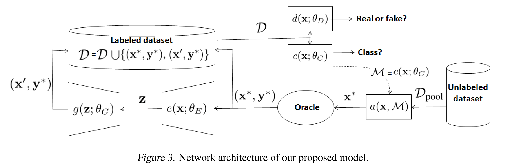

# Bayesian Generative Active Deep Learning
## Introduction
There are two interesting approach to design effective training methods that require small labele training sets:
* data augmentation  
It artificially generates new training points, but it indiscriminately generates samples that are not guaranteed to be informative.
* active learning  
It selects the "most informative" subset of unlabeled data to be labelled by an oracle, but it may be insufficient for the training process and overfit the informative training sets due to the small sizes.

In this paper, the authors combines active learning with data augmentation - Bayesian generative active deep learning approach. This work is mainly inspired by the following works:
* Query by synthesis active learning (Zhu & Bento, 2017)
* Bayesian data augmentation (Tran et al., 2017)
* Auxiliary-classifier generative adversarial networks (__ACGAN__) (Odena et al., 2017)
* Variational autoencoder (__VAE__) (Kingma & Welling, 2013)  
Specifically, they use the concept of Bayesian active learning by disagreement (__BALD__) (Gal et al., 2017; Houlsby et al., 2011) to select informative samples, the samples are then delivered to an oracle for annotation and to the __VAE-ACGAN__ for artificial samples generation.

## BALD
This scheme measures the acquistion function by the "mutual information" of the __training sample__ with respect to the __model parameters__. Because the evaluation of the acquistion function is based on the model __uncertainty__, we need to get the approximation of the posterior distribution of the model parameters. Specifically, Monte Carlo dropout method is used to approximate the acquisition functions. In this paper, the authors also adopted this method.

## Generative active Learning
Generating informative samples can significantly accelerate the training process in active learning. In Zhu & Bento's work, the GAN model has been pre-trained and the optimization during generation is solved efficiently. However, it means that the GAN model is not fine-tuned  in the training progresses, the generative and discriminative models do not __"co-evolve"__.
In this paper, the generation processing is conditioned on slected samples and the learner and Xthe generator are jointly trained, i.e. "co-evolve" during training. They show the generated samples belong to the sufficiently small neighborhood of the target empirically and mathmatically.  

## Information-Preserving data augmentation for active learning

