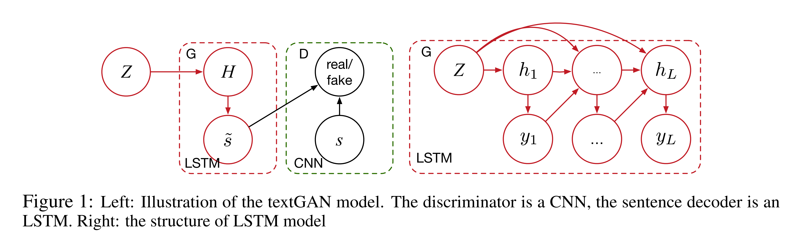

# Generating Text via Adversarial Training (Zhang, Gan, Carin; Duke; NIPS 2016)

## Introduction
Consider the application of GAN in NLP field, the discrete output of language model hinders the direct transition of gradient-based GANs.  
The autoencoder-based method may fail to generate realistic sentences from arbitrary latent representations. Because when mapping sentences to the corresponding hidden representations using an autoencoder, the representations of these sentences may often occupy a small region in the hiddent space. Hence, using a randomly generated hidden space do not necessarily maps to a realistic sentence.  
Another challenge is the exponetially accumulated error with the lengh of the generated sentence ude to the nature of RNN.  
In this paper, the authors proposed an __adversarial training scheme__, in which they adopted LSTM as generator and CNN as discriminator.

## TextGAN
### LSTM Generator
The decoder translates a __latent vector__ z into the synthetic sentence s'. The first word is given by argmax(Vh1), where h1 = tanh(Cz). All other words in the sentence are then sequentially generated using the RNN, until the end symbol is generated.

### CNN Discriminator
a convolution layer + a max-pooling operation  
A sentence of length T is represented as a matrix X ∈ R^(k\*T) by concatenating its word embeddings as colunmns.  
The model uses multiple filters with varing window sizes, and each filter can be considered as a linguistic feature detector.

### Objective function
The original obejective function of GAN is the minimization of __Jensen Shannon Divergence(JSD)__, which derived from the __Kullbach-Liebler Divergence(KLD)__. In this paper, the authors adopted an approach similar to feature matching to minimize the Loss_D and Loss_G. In their revised Loss_G, the feature covariance of real and synthetic data is emphisized. 

## Experiment
Two datasets to integrate both scientific and vocabulary writing style.
* BookCorpus dataset
* ArXiv dataset  
Choose 1 million sentences from each one, CNN encoder has 3 window sizes with 300 feature maps each, hence a 900-dimensional vector.  
LSTM decoder has one hidder layer of 500 units. 

## Result
Their results show two things:  
* The __empirical expectation__ of 900 features from synthetic sentences matches well with those from the real sentences. 
* The intermediate sentences does not make sense when they are generated via the linear transition between two random points in the latent space.

## Summary & Criticism
This paper explores learning a continous hidden representations space to generate realistic text in a holistic manner. By reconstruct the objective function of GAN, they proposed the variant textGAN, but the results falls to inllustrate the meaning of the generated intermediate sentences and did not present the whether the generated text make sense from the semantic or syntactic perspective. Neither did it tell us the detail of the expectation calculation. It could be trival when the sentences are encoded by word embeddings even the synthetic and real sentences is similar from the view of expectation. Moreover, the authors mentioned that the discriminator can still sufficiently distinghuish the synthetic sentences (92%), which means the result is not as strong as the expectation plots.

## Inspirition
* The revised objective function of GAN avoid the discrete output which cannot be handle by the  gradient-based GAN. They adopted the —__feature-matching__ approach in the objective function.
* The inspirition from the intermediate sentences produced from a linear transition between two andom points: 
1. How about give a cluster of sentences within a sufficient small distance and annotate them with the label of the center sentence? Kind of sudo label or KNN?  
2. How about an interpolation method? Find the intermediate latent representation and produce the tokens based on the fixed labels. It may help the efficiency of the model.
