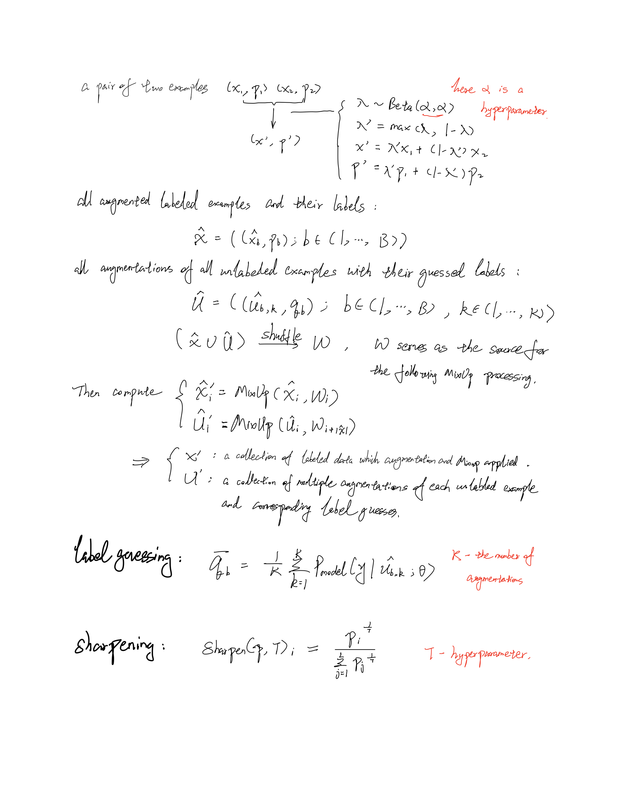

# MixMatch: A Holistic Approach to Semi-SSupervised Learning

## Introduction
Semi-supervised learning (SSL) seeks to largely alleviate the need for labeled fdata by allowing a model to leverage unlabeled data. Many SSL add a loss term implemented on unlabeld data to envourage the model to generalize better, and there are mainly 3 designs of the loss term in recent works:
* Entropy minimization - encourages the model to output __confident predictions__ on unlabeled data, i.e. the classifier's decision boundary should not pass through high-density regions of the marginl data distribution
* Consistency regularization - encourages the model to produce the __same output distribution__ when its inputs are perturbed
* Generic regularization - encourages the model to __generalize__ well and avoid overfitting the training data  

This paper proposed __MixMatch__, which introduces a single loss that gracefully unifies the above threee dominant approaches to semi-supervised learning. They utilize data augmentation to produce the label-fixed generated data and label guessing for the unlabeled example. In the final step of MixMatch, they apply MixUp to construct the training set.

## MixUp

s
## Loss function

L - number of possible labels
H(p,q) is the cross-entropy between distributions p and q
T,K,alphd and lamda_u are hyperparameters.
The squared L2 loss in eq.(4) corresponds to the multiclass __Brier score__ which is bounded and less sensitive to completely incorrect predictions. It has frequently been used as a loss for predictions on unlabeled data in SSL.
