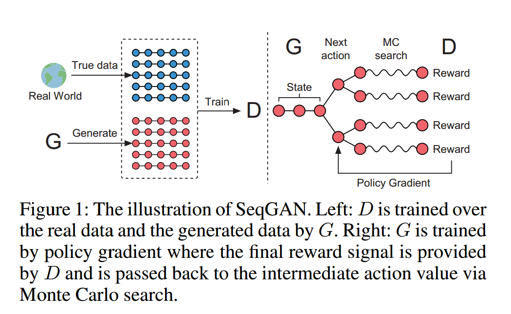

# SeqGAN: Sequence Generative Adversarial Nets with Policy Gradient (Yu et al. SJTU, AAAT 2017)

## Introduction
In the introduction, the authors discuessed two models:
* RNN with LSTM hve shown excellent performance. However, the maximization of the log predictive likelihood in RNN training suffers from exposure bias in the inference stage. Beogio et al. proposed a curriculum learning approach to solve this issue by increasing the generated tokens in the training set.  
* GAN. It is designed for generating real-valued and continuous data, so it has difficulty to deal with the discrete tokens. The slight change guidance from the discriminative net makes little sense because there is probably no corresponding token for such slight change in the limited dictionary space. And GAN can only assess the entire sequence once it is generated, but we want to balance the quality for the current step and the future score for the entire sequence during the training.

This paper proposed modeling the data generator as a stochasitic policy in reinforcement learning (RL), thus bypass the generator differentiation problem by directly performing the gradient policy update. (In the original settings of GAN, the words are selected by the output of softmax, here this step is done by the policy) And to consider the future outcome, they applied Monte Carlo search with a roll-out policy to sample the unknown words "after" the current timestep.

## Sequence Generative Adversarial Nets
The sequence data generation is formulated as a __sequential decision making process__ in this paper, where a reward signal is provided by the discriminator at the end of each episode via Monte Carlo approach, and the generator picks the "__action__" and learns the policy using estimated overall rewards.  
The generative model G_theta is updated by employing a policy gradient and MC searcch on the basis of the expected end reward received from the discriminative model D_phi.  
* Generator: RNN with LSTM cells to update function g
* Discriminator: CNN with an added highway architecture

## Experiments
They generated 10,000 sequnces of length 20 as the trainig set S for the generative models. And the ratio of real sentences and the fake ones is adjusted gently during the training, as the curriculum learning setting.  
After the generator was trained for many times, the discriminator got updated once. The discrepancy of the training between two parts will cause the discriminator providing a misleading signal gradually. With more discriminator training epochs, this issue could be alleviated.
They conduct four real-world experiments, including classical Chinese poem composition,  Barack Obama political speeches generation and music generation.

## Summary and Criticism
This paper combines GAN and policy gradient, transfering the text generation as a RL problem. The use of Monte Carlo search is also inspiring for the entire sequence evaluation before the generation completed. Though it still need more skill and insight to integrate GAN and RL, this paper has shown GAN's variant can be applied to sentence generation. However, we need to think it carefully how to implement such a SeqGAN under the limit of labeled data.

